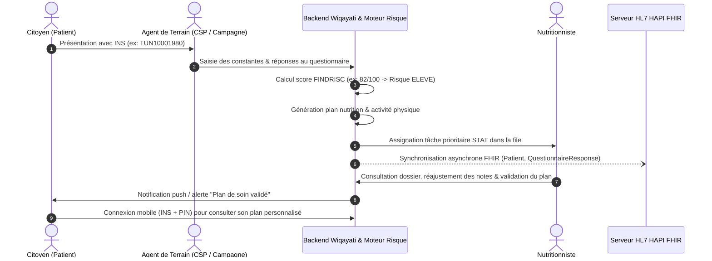

# 🌿 Wiqayati (وقايتي)
> **Plateforme Nationale Tunisienne de Dépistage Précoce et Prise en Charge du Diabète de Type 2**

[](https://github.com/amira-nasfi/wiqayati/actions/workflows/ci.yml)
[](https://www.python.org/)
[](https://www.djangoproject.com/)
[](https://react.dev/)
[](https://expo.dev/)
[](https://hl7.org/fhir/R4/)

---

## 📌 Présentation du Projet

**Wiqayati** est une solution numérique intégrée conçue pour le système de santé tunisien (Ministère de la Santé publique, Centres de Soins Primaires - CSP, et campagnes mobiles de dépistage). Elle permet :

1. **L'identification unique des patients** grâce à l'Identifiant National de Santé (**INS**).
2. **Le dépistage ciblé du diabète de type 2** à travers un questionnaire clinique standardisé administré par des agents de santé ou complété en auto-évaluation par les citoyens.
3. **L'évaluation instantanée du risque** via un moteur de règles cliniques (score FINDRISC adapté au contexte épidémiologique et nutritionnel tunisien : *Faible*, *Intermédiaire*, *Élevé*).
4. **La génération et la validation de plans de soins personnalisés** (nutrition méditerranéenne tunisienne + activité physique) par des nutritionnistes hospitaliers et de centres de référence.
5. **La gestion d'une file d'attente prioritaire** pour les professionnels de santé (`STAT` pour risque élevé, `URGENT` pour intermédiaire, `ROUTINE` pour faible).
6. **Le suivi citoyen sur mobile** (consultation des recommandations, historique, alertes et auto-évaluation).
7. **Le pilotage épidémiologique ministériel** via un tableau de bord analytique par gouvernorat.
8. **L'interopérabilité HL7/FHIR R4** avec le Dossier Médical Partagé (serveur HAPI FHIR : ressources *Patient*, *QuestionnaireResponse*, *RiskAssessment*, *CarePlan*).

---

## 🏗️ Architecture Technique

Le projet est structuré sous forme de **monorepo** :

```text
wiqayati/
├── backend/                  # API REST Django & moteur métier
│   ├── apps/
│   │   ├── accounts/         # Authentification unifiée, RBAC, profils, notifications
│   │   ├── audit/            # Piste d'audit immuable, traçabilité des accès de santé
│   │   ├── care_plan/        # Plans de soins nutrition & activité, validation clinique
│   │   ├── fhir_bridge/      # Client HAPI FHIR R4 & tâches asynchrones Celery
│   │   ├── nutritionist_queue/# File de tri des priorités pour les nutritionnistes
│   │   ├── risk_engine/      # Moteur algorithmique de calcul du risque diabétique
│   │   └── screening/        # Dépistage, patients, vues citoyen & tableau de bord ministère
│   ├── scripts/              # Scripts d'initialisation (seed_demo.py)
│   ├── wiqayati/             # Configuration Django, Celery et WSGI/ASGI
│   └── manage.py
├── frontend/                 # Application Web (React 19 + TypeScript + Vite)
│   ├── src/
│   │   ├── components/       # Barre de navigation, cartes, formulaires, modales
│   │   ├── context/          # Contexte d'authentification JWT (AuthContext)
│   │   ├── pages/            # Portails : Agent, Nutritionniste, Ministère, IT, Citoyen
│   │   └── services/         # Client HTTP Axios et appels d'API
│   └── vite.config.ts
├── mobile/                   # Application Mobile Citoyen (Expo + React Native)
│   ├── src/
│   │   ├── app/              # Routes Expo Router (dossier, plan, autoeval, alertes)
│   │   ├── components/       # Interface responsive mobile et web
│   │   └── services/         # Connexion simplifiée par INS + Code PIN
│   └── app.json
├── infra/                    # Infrastructure Docker
│   ├── docker-compose.yml    # PostgreSQL, Redis, HAPI FHIR R4
│   └── hapi-fhir/            # Configuration du serveur FHIR
└── .github/workflows/        # Pipeline CI / CD (lint, tests, build)
```

---

## 🔑 Identifiants de Démonstration pour Tous les Portails

La plateforme dispose de données de démonstration complètes pré-configurées représentant les différents acteurs du parcours de soins :

| Rôle | URL / Accès | Identifiant / INS | Mot de passe / PIN | Nom & Affectation | Fonctionnalités clés |
| :--- | :--- | :--- | :--- | :--- | :--- |
| **Super Administrateur** | `/django-admin/` | `superadmin` | `SuperAdmin2026!` | Super Admin | Administration système bas niveau Django |
| **Administrateur IT** | `/admin/it` | `admin.it` | `Admin2026!` | Karim Ben Salah *(DSI Santé)* | Supervision, journaux d'audit de santé, monitoring des services |
| **Admin Ministère** | `/admin/ministere` | `admin.ministere` | `Admin2026!` | Dr. Houda Meddeb *(Ministère Santé)* | Indicateurs nationaux, cartographie par gouvernorat, tendances |
| **Nutritionniste 1** | `/nutritionniste` | `nutri.ben_ali` | `Nutri2026!` | Sirine Ben Ali *(Hôpital Tunis)* | File priorisée, examen des dossiers, ajustement et validation de plans |
| **Nutritionniste 2** | `/nutritionniste` | `nutri.trabelsi` | `Nutri2026!` | Mohamed Trabelsi *(Hôpital Sfax)* | Prise en charge des tâches régionales Sfax |
| **Nutritionniste 3** | `/nutritionniste` | `nutri.chaabane` | `Nutri2026!` | Leila Chaâbane *(CSB Sousse)* | File d'attente Sousse & révision de plans |
| **Agent Campagne** | `/agent` | `agent.campagne.sfax`| `Agent2026!` | Khaled Ferchichi *(Campagne Sfax)* | Enregistrement patient INS, formulaire de dépistage terrain |
| **Agent Soins Primaires** | `/agent` | `agent.csp.tunis` | `Agent2026!` | Amina Gharbi *(CSP Tunis)* | Dépistage en consultation de médecine générale |
| **Agent Soins Primaires** | `/agent` | `agent.csp.sousse`| `Agent2026!` | Yassine Saidani *(CSP Sousse)* | Dépistage en consultation locale |
| **Citoyen 1 (Risque Élevé)** | `/citoyen` ou Mobile | `TUN10001980` | `1234` | Mohamed Haddad *(Tunis)* | Plan nutritionnel validé, alertes de suivi |
| **Citoyen 2 (Risque Élevé)** | `/citoyen` ou Mobile | `TUN10001975` | `1234` | Fatma Belhaj *(Sfax)* | Plan validé, suivi glycémique |
| **Citoyen 3 (Risque Élevé)** | `/citoyen` ou Mobile | `TUN10001968` | `1234` | Karim Mansouri *(Sousse)* | Plan en attente d'évaluation |
| **Citoyen 4 (Intermédiaire)** | `/citoyen` ou Mobile | `TUN10001990` | `1234` | Ines Zouari *(Tunis)* | Plan validé, rééquilibrage alimentaire |
| **Citoyen 5 (Risque Faible)** | `/citoyen` ou Mobile | `TUN10001985` | `1234` | Olfa Dridi *(Nabeul)* | Plan en révision / auto-évaluation |

> [!NOTE]
> Les utilisateurs web se connectent tous via la mire unique : **`http://localhost:5173/connexion`**. La redirection vers le portail approprié est automatique selon le rôle de l'utilisateur.

---

## 🚀 Guide de Démarrage et d'Exécution

### 1. Prérequis
* **Python** : 3.10 ou supérieur
* **Node.js** : 18.x ou 20.x et **npm** >= 9.x
* **Docker & Docker Compose** (pour PostgreSQL, Redis et HAPI FHIR)

---

### 2. Démarrer l'Infrastructure (Base de données, Redis, FHIR)

Depuis la racine du projet, lancez les services conteneurisés :

```bash
docker compose -f infra/docker-compose.yml up -d db redis hapi-fhir-db hapi-fhir
```

Services disponibles :
* **PostgreSQL (Django)** : `localhost:5434`
* **Redis (Broker Celery & Cache)** : `localhost:6379`
* **Serveur HAPI FHIR R4** : `http://localhost:8085/fhir`

---

### 3. Démarrer le Backend (Django)

1. Ouvrez un terminal dans le dossier `backend` :
   ```bash
   cd backend
   ```

2. Créez et activez un environnement virtuel :
   * **Windows (PowerShell)** :
     ```powershell
     python -m venv .venv
     .\.venv\Scripts\Activate.ps1
     ```
   * **Linux / macOS** :
     ```bash
     python3 -m venv .venv
     source .venv/bin/activate
     ```

3. Installez les dépendances :
   ```bash
   pip install -r requirements/base.txt -r requirements/development.txt
   ```

4. Appliquez les migrations de la base de données :
   ```bash
   python manage.py migrate
   ```

5. Initialisez toutes les données de démonstration :
   ```bash
   python scripts/seed_demo.py
   # ou via la commande Django :
   python manage.py seed_demo_data
   ```

6. Lancez le serveur de développement :
   ```bash
   python manage.py runserver 8000
   ```

Le backend est accessible sur **`http://localhost:8000`** :
* **Documentation OpenAPI / Swagger** : [`http://localhost:8000/api/docs/`](http://localhost:8000/api/docs/)
* **Administration Django** : [`http://localhost:8000/django-admin/`](http://localhost:8000/django-admin/)

*(Optionnel)* Lancez le worker Celery pour la synchronisation FHIR asynchrone :
```bash
celery -A wiqayati worker --loglevel=info
```

---

### 4. Démarrer le Frontend Web (Portail Professionnels & Citoyen)

1. Dans un second terminal, placez-vous dans le dossier `frontend` :
   ```bash
   cd frontend
   ```

2. Installez les dépendances :
   ```bash
   npm install
   ```

3. Lancez le serveur de développement Vite :
   ```bash
   npm run dev
   ```

L'application web est accessible sur **`http://localhost:5173`**.

---

### 5. Démarrer l'Application Mobile Citoyenne (Expo / React Native)

1. Dans un troisième terminal, placez-vous dans le dossier `mobile` :
   ```bash
   cd mobile
   ```

2. Installez les dépendances :
   ```bash
   npm install
   ```

3. Lancez l'application avec Expo :
   ```bash
   npx expo start
   ```
   * Appuyez sur **`w`** pour ouvrir la version Web dans votre navigateur (`http://localhost:8081`).
   * Scannez le QR Code avec l'application mobile **Expo Go** (Android / iOS) sur votre smartphone connecté au même réseau Wi-Fi.

---

### 6. Lancement Global via Turborepo (Alternative monorepo)

À la racine du projet, vous pouvez également utiliser les scripts configurés :

```bash
# Installer toutes les dépendances frontend et mobile
npm install

# Lancer le frontend web
npm run dev:frontend

# Lancer l'application mobile
npm run dev:mobile
```

---

## 🔄 Flux Clinique Complet (Scénario de Démonstration)

Pour tester la chaîne de bout en bout :



1. **Dépistage** : Connectez-vous en tant qu'agent (`agent.campagne.sfax` / `Agent2026!`) sur `http://localhost:5173/agent`.
   * Recherchez un patient existant ou créez un nouveau patient avec un identifiant INS.
   * Remplissez le formulaire de dépistage (âge, IMC, antécédents, glycémie, habitudes de vie).
   * Soumettez : le score de risque est calculé instantanément.
2. **Tri et Validation** : Connectez-vous en tant que nutritionniste (`nutri.ben_ali` / `Nutri2026!`) sur `http://localhost:5173/nutritionniste`.
   * La file d'attente affiche le patient classé en priorité selon son niveau de risque.
   * Ouvrez le dossier, modifiez les recommandations si nécessaire et validez le plan de soin.
3. **Consultation Citoyenne** : Connectez-vous sur le portail Citoyen web ou mobile avec l'INS du patient (ex : `TUN10001980` / `1234`).
   * Visualisez le statut du dépistage, les conseils nutritionnels et d'activité physique validés.
4. **Supervision Ministérielle** : Connectez-vous en tant que Ministère (`admin.ministere` / `Admin2026!`) sur `http://localhost:5173/admin/ministere`.
   * Observez la répartition géographique et les prévalences de facteurs de risque.

---

## 🧪 Tests et Qualité de Code

Le projet est vérifié automatiquement par un pipeline d'intégration continue GitHub Actions :

```bash
# 1. Vérification Flake8 Backend (PEP 8, longueur max 120 caractères)
python -m flake8 backend

# 2. Exécution des tests unitaires Django
python backend/manage.py test apps --settings=wiqayati.settings.development

# 3. Vérification des types TypeScript Frontend
npm run build --prefix frontend

# 4. Vérification des types TypeScript Mobile
npx tsc --noEmit --project mobile
```

---

## 📄 Licence

Ce projet est développé dans le cadre de la modernisation des systèmes d'information de santé préventive en Tunisie. Tous droits réservés.
