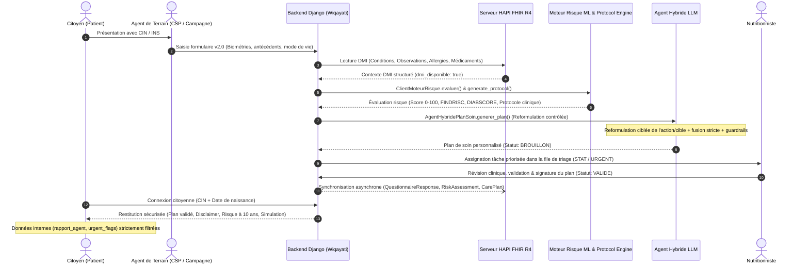

# 🌿 Wiqayati (وقايتي)
> **Plateforme Nationale Tunisienne de Dépistage Précoce et Prise en Charge du Diabète de Type 2**

[](https://github.com/amira-nasfi/wiqayati/actions/workflows/ci.yml)
[](https://www.python.org/)
[](https://www.djangoproject.com/)
[](https://react.dev/)
[](https://expo.dev/)
[](https://hl7.org/fhir/R4/)
[](backend/apps/risk_engine/ml/)

---

## 📌 Présentation du Projet

**Wiqayati** est une solution numérique de santé publique conçue pour la Tunisie (Ministère de la Santé publique, Centres de Soins Primaires - CSP et campagnes mobiles de dépistage). Elle allie **règles cliniques validées**, **modèle prédictif de machine learning** et **agent conversationnel hybride (LLM)** sous haute sécurité clinique :

1. **Identification unique** : Pivot national basé sur l'Identifiant National de Santé (**INS**) et recherche citoyenne simplifiée par **CIN (8 chiffres) + Date de naissance**.
2. **Formulaire de dépistage clinique v2.0** : Questionnaire étendu comprenant les biométries (`taille_cm`, `poids_kg`, `tour_taille_cm`, IMC auto-calculé, ratio taille/hanche), les antécédents médicaux (`high_glucose_hist`, HTA, corticoïdes, etc.) et le mode de vie (activité, alimentation, tabac). Rétrocompatibilité complète avec les clients v1.0.
3. **Moteur d'évaluation du risque hybride** :
   - **Score FINDRISC** (0-26) calibré en échelle 0-100 (*Faible*, *Intermédiaire*, *Élevé*).
   - **Score DIABSCORE** validé sur population tunisienne (Gannar et al. 2018, seuil T2D $\ge 90$).
   - **Détecteur ML de dysglycémie** : Modèle de régression logistique calibré par régression isotonique entraîné sur NHANES (23 966 adultes, 10 features cliniques, AUC pooled OOF 0.737, HL $p=0.34$).
   - **Client Python sécurisé (`ClientMoteurRisque`)** : Pas de `os.chdir()`, timeout maîtrisé (12s), absence de fallback silencieux vers des chiffres arbitraires (`ML_MODE=stub` disponible pour les tests).
4. **Agent Hybride LLM & Moteur Déterministe (`apps.care_plan.agent_hybride`)** :
   - Appel déterministe initial à `protocol_engine` (règles cliniques, ADA/DPP, contexte tunisien).
   - Reformulation ciblée par LLM : le modèle linguistique ne reformule que les champs textuels `action` et `target`.
   - Fusion stricte par nom de déclencheur (`trigger`) : préservation intégrale des métadonnées cliniques (`priority`, `category`, `title`, `evidence`, `source`).
   - Traçabilité : chaque recommandation est marquée `"metadata": {"prose_source": "llm" | "deterministic"}`.
   - Ré-application systématique des garde-fous cliniques post-fusion (`_apply_guardrails`).
   - Fallback déterministe instantané en cas d'erreur ou d'indisponibilité du LLM.
5. **Interopérabilité HL7/FHIR R4 & Dossier Médical Informatisé (DMI)** :
   - Serveur conteneurisé HAPI FHIR R4 (`http://localhost:8085/fhir`).
   - Extraction automatique en lecture seule du DMI patient : *Conditions* actives (CIM-10), *Observations* biologiques (HbA1c, glycémie), *Traitements* et *Allergies*.
   - Intégration dans le protocole de soin (ex : restriction sodée DASH pour HTA documentée, évitement d'allergènes alimentaires).
6. **Espace Citoyen Préventif & Avertissement Légal (Wellness Disclaimer)** :
   - Mention légale d'outil de bien-être et d'éducation à la santé bilingue (Français & Arabe, v1.0) systématiquement incluse.
   - Étanchéité absolue de l'API citoyenne (exclusion du `rapport_agent`, des `urgent_flags`, des orientations médicales internes et des valeurs DMI brutes).
   - Visualisation du **risque à 10 ans** (FINDRISC) avec mention de la cohorte source et **simulation d'impact DPP** (*« Si vous perdez 7 % de votre poids et marchez 30 min/jour : votre risque descend à X % »*).
7. **File d'attente nutritionniste priorisée** : Triage automatique des plans (`STAT`, `URGENT`, `ROUTINE`) pour certification avant diffusion.
8. **Tableau de bord ministériel** : Cartographie épidémiologique et KPIs par gouvernorat.

---

## 🏗️ Architecture Technique

```text
wiqayati/
├── backend/                  # API REST Django & moteur métier
│   ├── apps/
│   │   ├── accounts/         # Authentification unifiée, RBAC, profils, notifications
│   │   ├── audit/            # Piste d'audit immuable, traçabilité des accès
│   │   ├── care_plan/        # Plans de soins, Agent Hybride LLM, tests de sécurité
│   │   ├── fhir_bridge/      # Client HAPI FHIR R4, synchronisation & extraction DMI
│   │   ├── nutritionist_queue/# File de tri des priorités nutritionnistes
│   │   ├── risk_engine/      # ClientMoteurRisque, service ML & module ML intégré
│   │   │   └── ml/           # Module Machine Learning & Protocol Engine
│   │   │       ├── Nhanes_model.py     # Chargeur du modèle ML & featurizer
│   │   │       ├── risk_engine.py      # FINDRISC, DIABSCORE, risque 10 ans, simulation
│   │   │       ├── protocol_engine.py  # Moteur de règles déterministe & DMI
│   │   │       ├── wq_adapter.py       # Adaptateur payload WiQayati <-> Formulaire ML
│   │   │       ├── CHANGELOG.md        # Historique de versionnage du modèle
│   │   │       └── model/              # Artefacts pkl & schema.json audité
│   │   └── screening/        # Dépistage, ProfilPatient (INS), vues citoyen & ministère
│   ├── scripts/              # Scripts d'initialisation (seed_demo.py, seed_fhir_dmi.py)
│   ├── test_fhir_llm_dmi.py  # Test d'intégration de bout en bout FHIR -> DMI -> ML -> LLM
│   ├── wiqayati/             # Configuration Django, Celery et WSGI/ASGI
│   └── manage.py
├── frontend/                 # Application Web (React 19 + TypeScript + Vite)
│   ├── src/
│   │   ├── components/       # Composants d'interface, navigation, formulaires
│   │   ├── context/          # Contexte d'authentification JWT (AuthContext)
│   │   ├── pages/            # Portails : Agent (v2.0), Nutritionniste, Ministère, IT, Citoyen
│   │   └── services/         # Client Axios & endpoints API
│   └── vite.config.ts
├── mobile/                   # Application Mobile Citoyen (Expo + React Native)
│   ├── src/
│   │   ├── app/              # Routes Expo Router (dossier, plan, autoeval, alertes)
│   │   ├── components/       # Interface responsive mobile et sélecteur de date
│   │   └── services/         # Connexion simplifiée par INS + Code PIN ou CIN
│   └── app.json
├── infra/                    # Infrastructure Docker
│   ├── docker-compose.yml    # PostgreSQL (x2), Redis, Serveur HAPI FHIR R4
│   └── hapi-fhir/            # Configuration Spring Boot / application.yaml
└── .github/workflows/        # Pipeline CI/CD (lint, tests Django, builds TypeScript)
```

---

## 🔑 Identifiants de Démonstration (Mock Data Credentials)

La mire de connexion unifiée est disponible sur : **`http://localhost:5173/connexion`** (Web) ainsi que sur l'application mobile (Expo).

### 1. 🧑‍⚕️ Profils Professionnels (Santé & Administration)

| Rôle | URL / Portail | Identifiant | Mot de passe | Nom & Prénom | Structure / Affectation |
| :--- | :--- | :--- | :--- | :--- | :--- |
| **Super Administrateur** | `/django-admin/` | `superadmin` | `SuperAdmin2026!` | Super Admin | Administration système Django |
| **Administrateur IT** | `/admin/it` | `admin.it` | `Admin2026!` | Sami Bouaziz | DSI Ministère Santé (Supervision & FHIR) |
| **Admin Ministère** | `/admin/ministere` | `admin.ministere` | `Admin2026!` | Dr. Houda Meddeb | Direction Santé Publique (Cartographie) |
| **Nutritionniste 1** | `/nutritionniste` | `nutri.ben_ali` | `Nutri2026!` | Sirine Ben Ali | Hôpital Charles Nicolle, Tunis |
| **Nutritionniste 2** | `/nutritionniste` | `nutri.trabelsi` | `Nutri2026!` | Mohamed Trabelsi | CHU Hédi Chaker, Sfax |
| **Nutritionniste 3** | `/nutritionniste` | `nutri.chaabane` | `Nutri2026!` | Leila Chaâbane | CSB Sahloul, Sousse |
| **Agent Campagne** | `/agent` | `agent.campagne.sfax` | `Agent2026!` | Khaled Ferchichi | Unité Mobile Sfax (Dépistage terrain) |
| **Agent Soins Primaires**| `/agent` | `agent.csp.tunis` | `Agent2026!` | Amina Gharbi | CSP Bab Souika, Tunis |
| **Agent Soins Primaires**| `/agent` | `agent.csp.sousse` | `Agent2026!` | Yassine Saidani | CSB Sousse Ville |

---

### 2. 🇹🇳 Profils Citoyens (Patients)

Connexion par **CIN (8 chiffres)** et **Date de Naissance** (ou **INS + PIN**) :

| Patient (Nom & Prénom) | N° CIN | Date de Naissance | Identifiant INS | Code PIN | Gouvernorat | Statut & Profil |
| :--- | :---: | :---: | :---: | :---: | :--- | :--- |
| **Mohamed Haddad** *(Démo rapide)* | `08123456` | `15/03/1980` | `TUN10001980` | `1234` | Tunis | **Risque Élevé** (Plan validé, suivi actif) |
| **Fatma Belhaj** | `09234567` | `22/07/1975` | `TUN10001975` | `1234` | Sfax | **Risque Élevé** (Suivi glycémique renforcé) |
| **Karim Mansouri** | `07345678` | `05/11/1968` | `TUN10001968` | `1234` | Sousse | **Risque Élevé** (En attente nutritionniste) |
| **Ines Zouari** | `11456789` | `30/01/1990` | `TUN10001990` | `1234` | Tunis | **Risque Intermédiaire** (Plan hygiéno-diététique) |
| **Olfa Dridi** | `05567890` | `09/02/1985` | `TUN10001985` | `1234` | Nabeul | **Risque Faible** (Auto-évaluation conseillée) |

---

## 🚀 Guide de Démarrage Rapide

### 1. Prérequis
* **Python** 3.10 ou supérieur
* **Node.js** 18.x ou 20.x et **npm** >= 9.x
* **Docker & Docker Compose** (PostgreSQL, Redis, HAPI FHIR)

---

### 2. Lancer l'Infrastructure Conteneurisée
Depuis la racine du projet :
```bash
docker compose -f infra/docker-compose.yml up -d db redis hapi-fhir-db hapi-fhir
```
Vérification des services :
* **PostgreSQL (Wiqayati)** : `localhost:5434`
* **Redis** : `localhost:6379`
* **HAPI FHIR R4** : `http://localhost:8085/fhir/metadata` (HTTP 200 OK)

---

### 3. Démarrer le Backend Django

1. Ouvrez un terminal dans `backend` :
   ```bash
   cd backend
   ```
2. Activez votre environnement virtuel et installez les dépendances :
   ```bash
   pip install -r requirements/base.txt -r requirements/development.txt
   ```
3. Exécutez les migrations :
   ```bash
   python manage.py migrate
   ```
4. Peuplez les données de démonstration :
   ```bash
   python manage.py seed_demo_data
   ```
5. *(Optionnel)* Testez l'interconnexion HAPI FHIR et l'agent hybride avec DMI réel :
   ```bash
   python test_fhir_llm_dmi.py
   ```
6. Lancez le serveur Django :
   ```bash
   python manage.py runserver 8000
   ```

Endpoints essentiels :
* **API REST & Swagger** : [`http://localhost:8000/api/docs/`](http://localhost:8000/api/docs/)
* **Administration Django** : [`http://localhost:8000/django-admin/`](http://localhost:8000/django-admin/)
* **Portail Citoyen (Plan Actif)** : `GET /api/v1/citoyen/moi/plan-actif/`

---

### 4. Démarrer le Frontend Web

Dans un terminal dédié :
```bash
cd frontend
npm install
npm run dev
```
Accessible sur : **`http://localhost:5173`**.

---

### 5. Démarrer l'Application Mobile Citoyenne

Dans un terminal dédié :
```bash
cd mobile
npm install
npx expo start
```
* Appuyez sur **`w`** pour exécuter dans le navigateur web (`http://localhost:8081`).
* Ou scannez le QR code avec **Expo Go** sur Android / iOS.

---

## 🔬 Détails des Composants Métier & IA

### 1. Moteur Prédictif de Machine Learning (`apps.risk_engine.ml`)
* **Cible** : Dysglycémie (HbA1c $\ge 5.7\%$ ou Glycémie à jeun $\ge 100\text{ mg/dL}$).
* **Entraînement** : NHANES 2011-2020 (23 966 adultes américains sans diabète diagnostiqué).
* **Variables d'entrée (10)** : `age`, `gender`, `bmi`, `waist_circumference`, `whtr`, `family_diabetes`, `hypertension`, `high_glucose_ever`, `physical_activity`, `diabscore`.
* **Performances** : AUC = 0.737, calibration isotonique (Hosmer-Lemeshow $p=0.34$).
* **Fichiers clés** :
  - [`apps/risk_engine/ml/Nhanes_model.py`](backend/apps/risk_engine/ml/Nhanes_model.py) : Chargeur robuste du pipeline scikit-learn.
  - [`apps/risk_engine/ml/wq_adapter.py`](backend/apps/risk_engine/ml/wq_adapter.py) : Traducteur bidirectionnel contrat WiQayati $\leftrightarrow$ Features ML.
  - [`apps/risk_engine/client.py`](backend/apps/risk_engine/client.py) : Client de risque avec exécution multi-threadée (thread-safe, sans `os.chdir()`) et timeout de 12 secondes.

### 2. Protocole Déterministe & Support DMI (`apps.risk_engine.ml.protocol_engine`)
* Dérive un ensemble d'actions préventives fondées sur les preuves cliniques (Diabetes Prevention Program - DPP, ADA, OMS, étude tunisienne Gannar et al. 2018).
* Consomme en entrée optionnelle le dictionnaire `dmi` :
  - **Hypertension active (I10)** $\rightarrow$ Recommandation prioritaire de régime DASH et apport sodé $<5\text{ g/jour}$.
  - **Allergies alimentaires documentées** $\rightarrow$ Évitement automatique dans les cibles diététiques.
  - **Glycémie / HbA1c documentée** $\rightarrow$ Ajustement de l'urgence de consultation médicale.

### 3. Agent Hybride LLM (`apps.care_plan.agent_hybride`)
* **Design** : Le LLM intervient exclusivement pour reformuler en langage clair et bienveillant les champs textuels `action` et `target`.
* **Règle de fusion** :
  - Correspondance stricte par `trigger`.
  - Copie sélective de `action` et `target`.
  - Préservation intégrale de tous les autres champs (`priority`, `category`, `title`, `evidence`, `source`).
  - Aucun item ne peut être ajouté ou retiré par le LLM.
* **Garde-fous cliniques** : Ré-évaluation déterministe via `_apply_guardrails()` après fusion.
* **Traçabilité** : Marquage explicite `"prose_source": "llm"` ou `"prose_source": "deterministic"`.

### 4. Transparence Légale & Exposition Citoyenne
* **Wellness Disclaimer** : Conforme au statut d'outil de prévention non médical, la réponse API et l'interface citoyenne intègrent le texte légal :
  > *« Ce document est un support d'éducation à la santé. Il ne remplace pas un avis médical. Consultez un professionnel de santé pour toute décision concernant votre santé. »*
  > *« هذا المستند هو دعم تثقيفي صحي ولا يحل محل الاستشارة الطبية. استشر أخصائي الرعاية الصحية لأي قرار. »*
* **Risque à 10 ans & Simulation** :
  - Restitution du score FINDRISC et du pourcentage de risque futur.
  - Mention de la cohorte source : *« Cohorte finlandaise originale — non validée pour la Tunisie »*.
  - Simulation dynamique montrant l'impact concret d'une perte de 7% de poids et d'une activité physique régulière.

---

## 🔄 Flux Clinique Complet


```mermaid
sequenceDiagram
    autonumber
    actor C as Citoyen (Patient)
    actor A as Agent de Terrain (CSP / Campagne)
    participant B as Backend Django (Wiqayati)
    participant F as Serveur HAPI FHIR R4
    participant ML as Moteur Risque ML & Protocol Engine
    participant LLM as Agent Hybride LLM
    actor N as Nutritionniste

    C->>A: Présentation avec CIN / INS
    A->>B: Saisie formulaire v2.0 (Biométries, antécédents, mode de vie)
    B->>F: Lecture DMI (Conditions, Observations, Allergies, Médicaments)
    F-->>B: Contexte DMI structuré (dmi_disponible: true)
    B->>ML: ClientMoteurRisque.evaluer() & generate_protocol()
    ML-->>B: Évaluation risque (Score 0-100, FINDRISC, DIABSCORE, Protocole clinique)
    B->>LLM: AgentHybridePlanSoin.generer_plan() (Reformulation contrôlée)
    Note over LLM: Reformulation ciblée de l'action/cible + fusion stricte + guardrails
    LLM-->>B: Plan de soin personnalisé (Statut: BROUILLON)
    B->>N: Assignation tâche priorisée dans la file de triage (STAT / URGENT)
    N->>B: Révision clinique, validation & signature du plan (Statut: VALIDE)
    B--)F: Synchronisation asynchrone (QuestionnaireResponse, RiskAssessment, CarePlan)
    C->>B: Connexion citoyenne (CIN + Date de naissance)
    B-->>C: Restitution sécurisée (Plan validé, Disclaimer, Risque à 10 ans, Simulation)
    Note over C: Données internes (rapport_agent, urgent_flags) strictement filtrées
```

---

## 🧪 Tests et Qualité de Code

```bash
# 1. Vérification système Django
python backend/manage.py check

# 2. Suite complète de tests unitaires et d'intégration
python backend/manage.py test apps.risk_engine apps.care_plan apps.screening

# 3. Vérification de typage et compilation Frontend
npm run build --prefix frontend

# 4. Vérification typage TypeScript Mobile
npx tsc --noEmit --project mobile

# 5. Validation de la chaîne complète FHIR -> DMI -> ML -> LLM
python backend/test_fhir_llm_dmi.py
```

---

## 📄 Licence
Ce projet est développé dans le cadre de la modernisation des systèmes d'information de santé préventive en Tunisie. Tous droits réservés.
