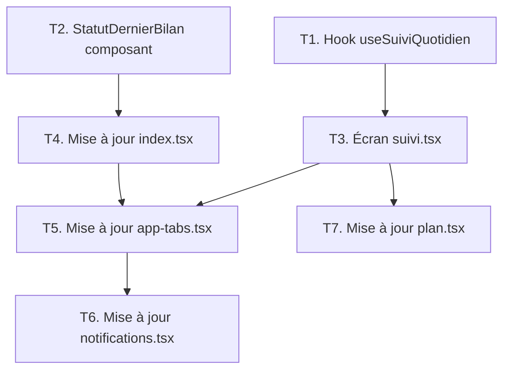

# Plan d'implémentation — « Mon suivi quotidien »
## Extension bien-être secondaire de l'app mobile Wiqayati

> **Règle d'or** : L'app reste PRINCIPALEMENT un outil de dépistage. Le suivi quotidien est une extension secondaire, ancrée dans le plan validé par le nutritionniste — jamais une app fitness autonome.

---

## ÉTAPE 1 — Résumé de l'existant

### 1.1 Navigation actuelle

Le fichier [`app-tabs.tsx`](file:///c:/Users/amira/AppData/Local/Programs/Python/Python310/wiqayati/mobile/src/components/app-tabs.tsx) gère 4 onglets via `NativeTabs` (expo-router) :

| Onglet | Fichier | Rôle |
|---|---|---|
| **Dossier** (`index`) | `src/app/index.tsx` | Profil citoyen + historique évaluations |
| **Mon Plan** (`plan`) | `src/app/plan.tsx` | Plan nutrition + activité validé par nutritionniste |
| **Évaluation** (`autoeval`) | `src/app/autoeval.tsx` | Auto-évaluation FINDRISC (formulaire) |
| **Alertes** (`notifications`) | `src/app/notifications.tsx` | Notifications push + marquage lu/non-lu |

Le layout racine [`_layout.tsx`](file:///c:/Users/amira/AppData/Local/Programs/Python/Python310/wiqayati/mobile/src/app/_layout.tsx) gère l'auth : pas connecté → `connexion.tsx`, connecté → `AppTabs`.

### 1.2 Modèles de données côté app (interfaces TypeScript actuelles)

**`plan.tsx` — PlanActif** :
```typescript
interface PlanActif {
  a_un_plan_valide: boolean;
  message?: string;
  valide_le?: string;
  notes_nutritionniste?: string;
  plan_nutrition?: {
    titre: string;
    objectifs: string[];          // ← objectifs déclarés dans le plan
    conseils_specifiques?: string;
  };
  plan_activite?: {
    titre: string;
    objectifs: string[];          // ← objectifs déclarés dans le plan
    frequence_hebdomadaire?: number;  // ← cible en séances/semaine
    duree_seance_minutes?: number;    // ← durée cible par séance
  };
}
```

**`index.tsx` — Evaluation** :
```typescript
interface Evaluation {
  id: string;
  evalue_le: string;
  score: number;
  niveau_risque: 'FAIBLE' | 'INTERMEDIAIRE' | 'ELEVE';
  niveau_risque_libelle: string;
}
```

**`notifications.tsx` — Notification** :
```typescript
interface Notification {
  id: string;
  type_libelle: string;
  type: 'PLAN_VALIDE' | 'NOUVEAU_SCREENING' | 'RAPPEL' | 'INFO';
  message: string;
  lu: boolean;
  cree_le: string;
}
```

### 1.3 API mobile utilisée

Base URL dynamique via [`client.ts`](file:///c:/Users/amira/AppData/Local/Programs/Python/Python310/wiqayati/mobile/src/api/client.ts).
Endpoints actuels :
- `GET /citoyen/moi/historique-risques/`
- `GET /citoyen/moi/plan-actif/`
- `GET /citoyen/notifications/`
- `PATCH /citoyen/notifications/{id}/marquer-comme-lu/`
- `POST /citoyen/notifications/marquer-tous-lus/`

### 1.4 Ce qui change vs ce qui reste

| Élément | Action |
|---|---|
| `_layout.tsx` | ✅ **Aucun changement** |
| `connexion.tsx` | ✅ **Aucun changement** |
| `autoeval.tsx` | ✅ **Aucun changement** (écran de dépistage intact) |
| `index.tsx` | 🔧 **Légère évolution** : ajouter le statut risque actuel + CTA évaluation en haut |
| `plan.tsx` | 🔧 **Légère évolution** : ajouter un encart "Aujourd'hui" avec aperçu du suivi |
| `notifications.tsx` | 🔧 **Légère évolution** : filtrage par catégorie (dépistage vs suivi) |
| `app-tabs.tsx` | 🔧 **Évolution** : remplacer l'onglet `explore` (démo Expo) par `suivi` |
| **`suivi.tsx`** | ✨ **NOUVEAU** : écran Mon suivi quotidien |
| **`src/hooks/useSuiviQuotidien.ts`** | ✨ **NOUVEAU** : hook de gestion données suivi |

---

## ÉTAPE 2 — Nouvelle architecture de navigation

### Principe de hiérarchie visuelle

```
[Tab 1 : Dossier]  [Tab 2 : Mon Plan]  [Tab 3 : Évaluation]  [Tab 4 : Suivi]  [Tab 5 : Alertes]
   🏥 Principal        📋 Principal         🔬 Principal         📊 Secondaire    🔔 Système
```

> L'onglet **Suivi** est visuellement plus discret (icône plus petite, label court). Les 3 premiers onglets restent les onglets "métier" principaux.

### Onglet 4 — « Mon suivi quotidien »

- **Nom** : `suivi` (route `src/app/suivi.tsx`)
- **Label** : `Suivi`
- **Contrainte forte** : s'affiche uniquement si l'utilisateur a un plan validé (`a_un_plan_valide: true`). Sinon → message "Disponible après la validation de votre plan."

### Modifications de l'écran Dossier (`index.tsx`)

Ajouter **en haut**, avant l'historique :
1. **Carte "Mon dernier bilan"** : niveau de risque + date + score FINDRISC de la dernière évaluation
2. **CTA conditionnel** : si la dernière évaluation date de > 12 mois → bouton "Refaire mon évaluation" (navigue vers onglet Évaluation)
3. **Lien rapide** : "Voir mon plan" (navigue vers onglet Mon Plan)

### Modifications des Alertes (`notifications.tsx`)

Ajouter un **filtre par catégorie** :
- **Dépistage** (types : `PLAN_VALIDE`, `NOUVEAU_SCREENING`, `RAPPEL_EVALUATION`) — activé par défaut, non désactivable
- **Suivi quotidien** (type : `SUIVI_MANQUE`, `ENCOURAGEMENT`) — désactivable par l'utilisateur

---

## ÉTAPE 3 — Modèle de données du suivi quotidien

### 3.1 Structure locale (AsyncStorage côté app)

```typescript
// Clé : `suivi_${citoyenINS}_${dateISO}` ex: suivi_TUN10002002_2026-09-25
interface EnregistrementSuiviJournalier {
  date: string;            // ISO date 'YYYY-MM-DD'
  citoyen_ins: string;

  // Activité physique (par rapport aux objectifs du plan)
  activite: {
    faite: boolean;                 // checkbox principale
    duree_minutes?: number;         // optionnel
    note_libre?: string;            // optionnel, 100 chars max
  };

  // Nutrition (par rapport aux objectifs du plan)
  nutrition: {
    objectifs_respectes: number;    // 0 à N (N = nb objectifs du plan)
    total_objectifs: number;        // copié depuis plan au moment de la saisie
    note_libre?: string;            // optionnel
  };

  // Méta
  saisi_a: string;   // ISO datetime
  synced: boolean;   // envoyé au serveur ou non
}
```

### 3.2 Endpoint backend à créer (nouveau, non bloquant)

```
POST /citoyen/suivi-quotidien/
GET  /citoyen/suivi-quotidien/?date_debut=YYYY-MM-DD&date_fin=YYYY-MM-DD
```

> **Note** : Le suivi fonctionne **en mode offline-first** avec AsyncStorage. La synchronisation vers le serveur est optionnelle dans la v1. L'app ne bloque pas si l'API est indisponible.

### 3.3 Lien avec le plan validé

Les objectifs affichés dans le suivi sont **toujours** copiés depuis `plan_actif` au premier chargement :
- Fréquence cible : `plan_activite.frequence_hebdomadaire` séances/semaine
- Durée cible : `plan_activite.duree_seance_minutes` min/séance
- Objectifs nutrition : `plan_nutrition.objectifs[]` (liste à cocher)

> Le suivi ne génère **jamais** ses propres objectifs génériques — il référence toujours le plan du nutritionniste.

---

## ÉTAPE 4 — Liste des écrans et composants nouveaux/modifiés

### Nouveaux fichiers

| Fichier | Type | Rôle |
|---|---|---|
| `src/app/suivi.tsx` | Écran | Mon suivi quotidien (saisie + historique semaine) |
| `src/hooks/useSuiviQuotidien.ts` | Hook | Lecture/écriture AsyncStorage + sync API |
| `src/components/SuiviJournalierCard.tsx` | Composant | Carte d'un jour (activité + nutrition) |
| `src/components/ObjectifPlanBadge.tsx` | Composant | Badge "Objectif du plan" réutilisable |
| `src/components/StatutDernierBilan.tsx` | Composant | Carte bilan rapide pour l'écran Dossier |

### Fichiers modifiés (changements mineurs)

| Fichier | Modification |
|---|---|
| `src/components/app-tabs.tsx` | Remplace `explore` par `suivi`, ajuste l'ordre et les icônes |
| `src/app/index.tsx` | Ajoute `<StatutDernierBilan />` en haut + CTA conditionnel |
| `src/app/notifications.tsx` | Ajoute le filtre catégorie (chips Dépistage / Suivi) |
| `src/app/plan.tsx` | Ajoute un encart "Votre suivi d'aujourd'hui" en bas |

---

## ÉTAPE 5 — Découpage des tâches (séquentielles avec dépendances)



### T1 — `useSuiviQuotidien.ts` (aucune dépendance)
- Fonctions : `chargerSuiviDuJour(date)`, `sauvegarderSuivi(enregistrement)`, `chargerSemaineEnCours()`
- Utilise `AsyncStorage` (déjà dans les dépendances Expo)
- Tente la sync API en arrière-plan (fire-and-forget, sans bloquer l'UI)

### T2 — `StatutDernierBilan.tsx` (aucune dépendance)
- Props : `evaluations: Evaluation[]`
- Affiche : niveau de risque (badge coloré), score, date
- CTA conditionnel : si dernière évaluation > 12 mois

### T3 — `suivi.tsx` (dépend de T1)
- Consomme `useSuiviQuotidien`
- Consomme `plan_actif` (via API existante)
- Sections :
  - **Aujourd'hui** : checklist activité + checklist nutrition (basée sur plan)
  - **Cette semaine** : mini-calendrier (7 jours) avec indicateurs vert/orange/vide
- Si pas de plan validé : écran vide avec message explicatif

### T4 — Mise à jour `index.tsx` (dépend de T2)
- Insère `<StatutDernierBilan />` en premier dans le `ScrollView`
- Pas de refactoring du reste de l'écran

### T5 — Mise à jour `app-tabs.tsx` (dépend de T3 et T4)
- Remplace `{ nom: 'explore', libelle: 'Explorer', ... }` par `{ nom: 'suivi', libelle: 'Suivi', ... }`
- **Risque de régression** : s'assurer que les 4 autres routes sont inchangées

### T6 — Mise à jour `notifications.tsx` (dépend de T5)
- Ajouter 2 chips en haut : **Dépistage** | **Suivi**
- Filtrage côté app (pas d'appel API supplémentaire)
- Les types `PLAN_VALIDE`, `NOUVEAU_SCREENING`, `RAPPEL` → catégorie Dépistage
- Les types futurs `SUIVI_MANQUE`, `ENCOURAGEMENT` → catégorie Suivi

### T7 — Mise à jour `plan.tsx` (dépend de T3)
- Ajouter en bas un encart "Votre progression aujourd'hui"
- Affiche les compteurs du `useSuiviQuotidien` pour le jour courant

---

## ÉTAPE 6 — Risques et garde-fous

### Risque 1 : Confusion de hiérarchie visuelle

**Problème** : Si l'onglet "Suivi" est trop visible ou son contenu trop riche, l'utilisateur pourrait percevoir l'app comme un tracker fitness, en oubliant que c'est un outil de dépistage.

**Garde-fous** :
- Titre de l'écran suivi : « Mon suivi — Plan du [date_validation] » (rappel de l'origine médicale)
- Un encart fixe en haut : "Objectifs définis par votre nutritionniste le [date]"
- Pas d'historique sur plus de 7 jours dans la v1 (pas de graphiques de tendance)
- Label discret : `Suivi` (pas `Bien-être`, pas `Fitness`)

### Risque 2 : Régression sur le flux de dépistage existant

**Éléments sensibles** :
- `autoeval.tsx` : formulaire FINDRISC — **ne pas toucher**
- `connexion.tsx` : authentification — **ne pas toucher**
- `_layout.tsx` : routing auth — **ne pas toucher**
- Les appels API existants (`/citoyen/moi/plan-actif/`, `/citoyen/moi/historique-risques/`)

**Garde-fou** : Tâche T5 (modification `app-tabs`) uniquement après T3 et T4 validés. Tests manuels des 4 onglets existants après T5.

### Risque 3 : Incohérence plan/objectifs du suivi

**Problème** : Si l'utilisateur a un nouveau plan validé après avoir commencé un suivi, les objectifs en cache pourraient être obsolètes.

**Garde-fou** : 
- Le hook `useSuiviQuotidien` recharge toujours les objectifs depuis `plan_actif` à chaque ouverture de l'écran
- En cas de nouveau plan validé (notification `PLAN_VALIDE`), effacer le cache des objectifs

### Risque 4 : Mode offline

**Problème** : L'AsyncStorage peut se désynchroniser avec le serveur.

**Garde-fou** : 
- Dans la v1, la saisie locale est la source de vérité
- Afficher un indicateur discret "Non synchronisé" si la sync échoue
- Pas de conflit possible car un seul appareil par citoyen

---

## Résumé des dépendances techniques

| Lib | Déjà présente ? | Usage |
|---|---|---|
| `@react-native-async-storage/async-storage` | ✅ Expo inclus | Persistence locale suivi |
| `expo-router` (NativeTabs) | ✅ | Navigation onglets |
| `axios` (apiMobile) | ✅ | Sync serveur (optionnelle v1) |
| `expo-notifications` | ❓ À vérifier | Alertes suivi quotidien (v2) |

---

> **Prochaine étape** : Validation du plan par l'utilisateur → implémentation séquentielle T1 → T2 → T3 → T4 → T5 → T6 → T7.
